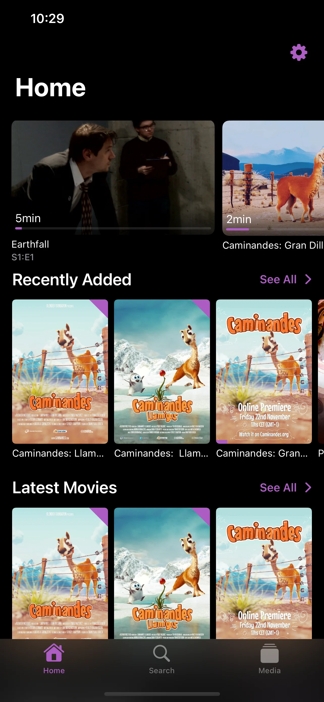
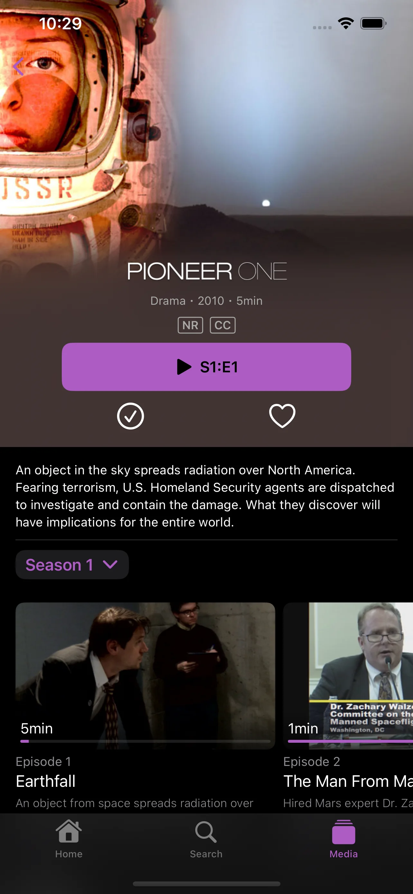
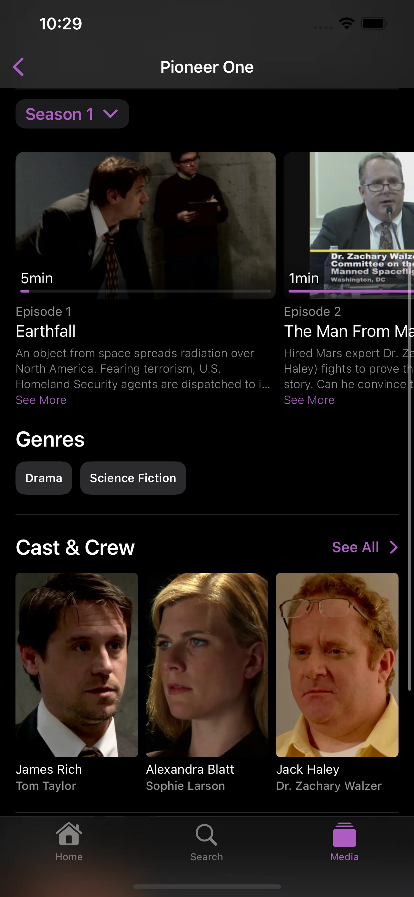
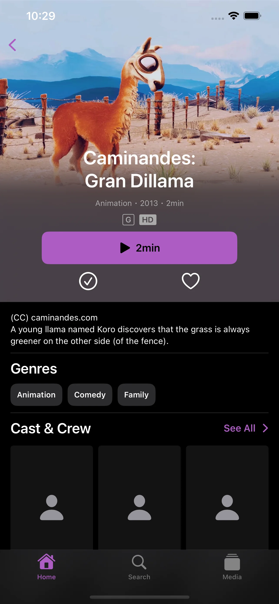
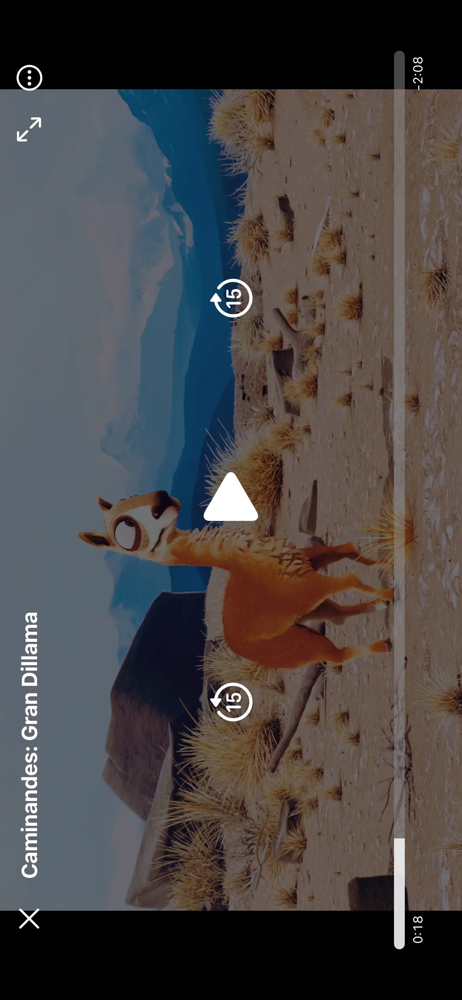

Swiftfin is a fast, native video player that works with Jellyfin, the open source free software media server.

To use the app, you must have a Jellyfin server set up and running. Find out more at https://jellyfin.org

With a Jellyfin server, you can:
- Watch Live TV and recorded shows from your Jellyfin server (additional hardware/services required)
- Stream your video to your iOS/iPadOS device
- View your collection in an easy to use interface

This is an official Jellyfin companion app. Thank you for using Jellyfin!

| | |
|---|---|
|  |  |
|  |  |
|  | |

<!-- Upstream Swiftfin Source Code Repository: https://github.com/jellyfin/Swiftfin -->
